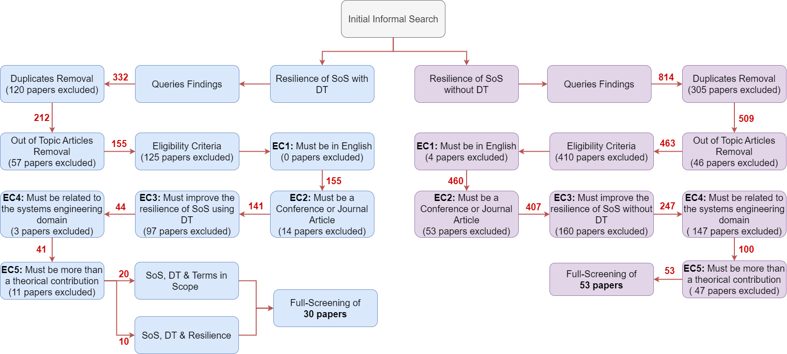

# System-of-Systems Resilience: A Systematic Literature Review - Materials  

This repository contains the resources and materials for the systematic literature review (SLR) titled *"System of Systems Resilience: A Systematic Literature Review"*, published in the journal [ACM Computing Surveys](https://dl.acm.org/journal/csur).  

## Repository Structure  

The repository is organized into two main folders:  
1. **Screening Title, Abstract, Keywords**: Contains materials and data related to the initial screening of titles, abstracts, and authors’ keywords.  
2. **Full Screening**: Includes resources for the full-text review of selected papers.  

The figure below provides an overview of the process followed to select the final set of papers for the review.  

  

  

## Sub-Studies  

As depicted in the figure, the review encompasses two sub-studies within the broader analysis:  
- **System of Systems (SoS) Resilience without Digital Twins (DTs)**: Focused on extracting insights from "traditional methods" used to enhance resilience in SoS.  
- **System of Systems Resilience using Digital Twins (DTs)**: Examines the contributions of DTs to improving the resilience of SoS.  

## Further Information  

For detailed insights and findings, refer to our article: *"System of Systems Resilience: A Systematic Literature Review"*.  

## Authors  

- Meriem Smati  
- Jannik Laval  
- Christophe Danjou  
- Vincent Cheutet  
